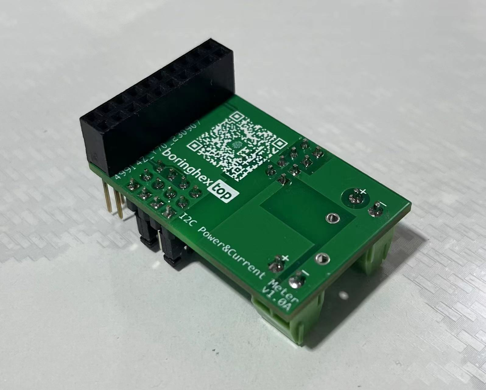
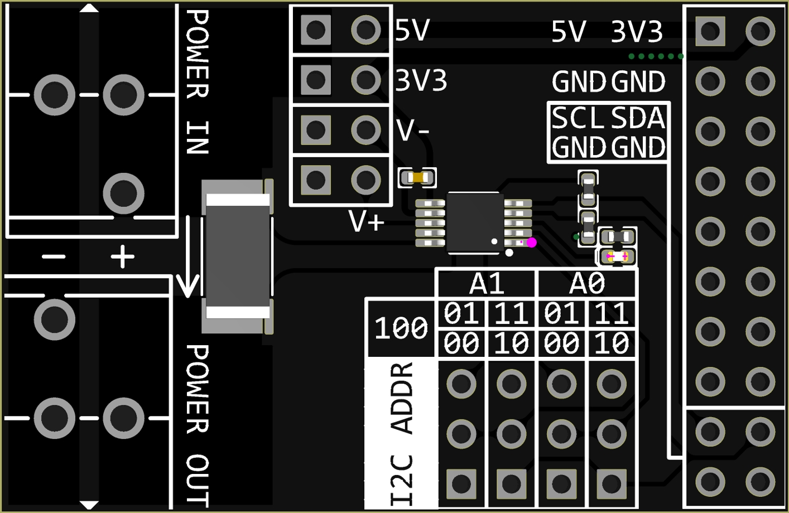
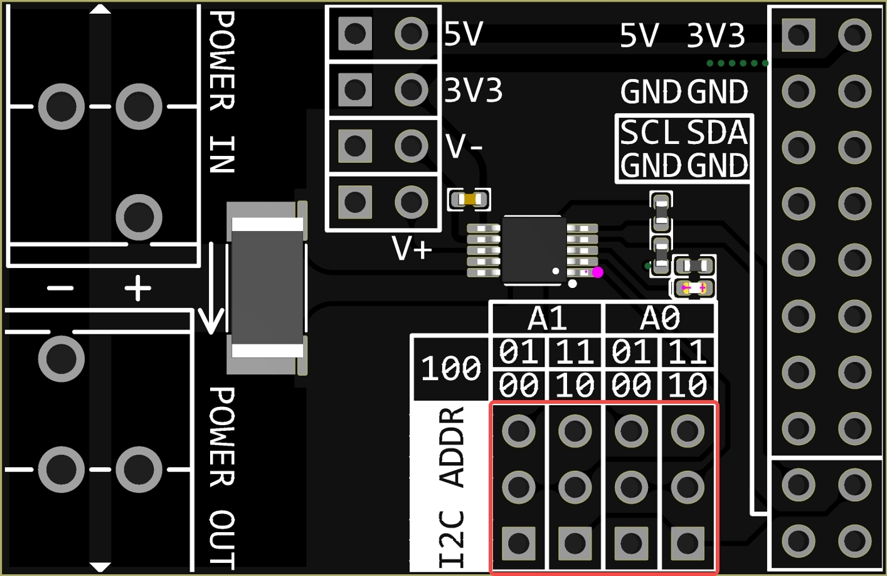
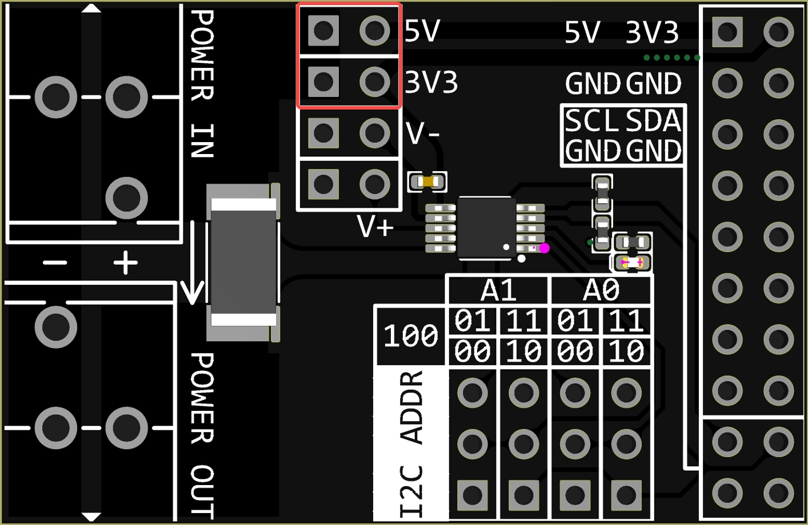
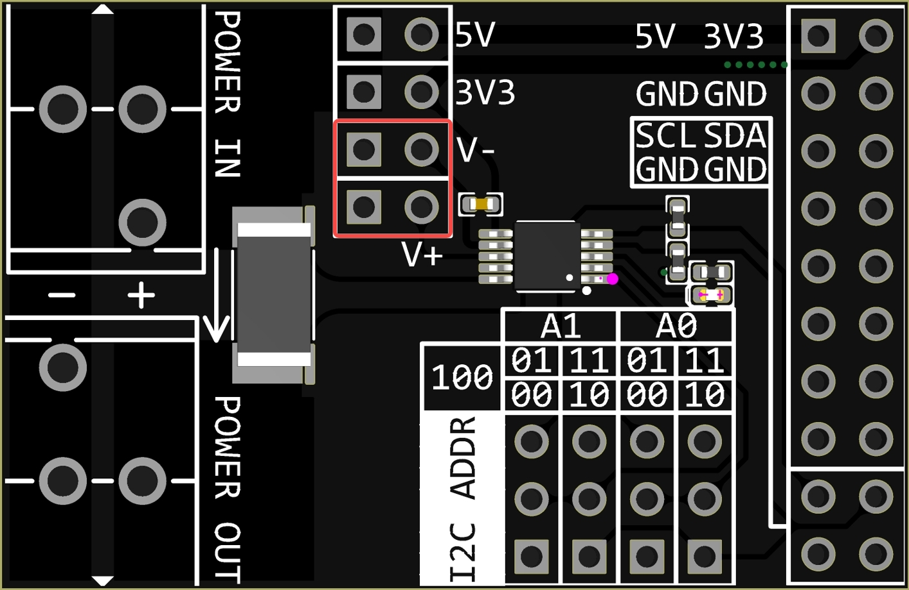
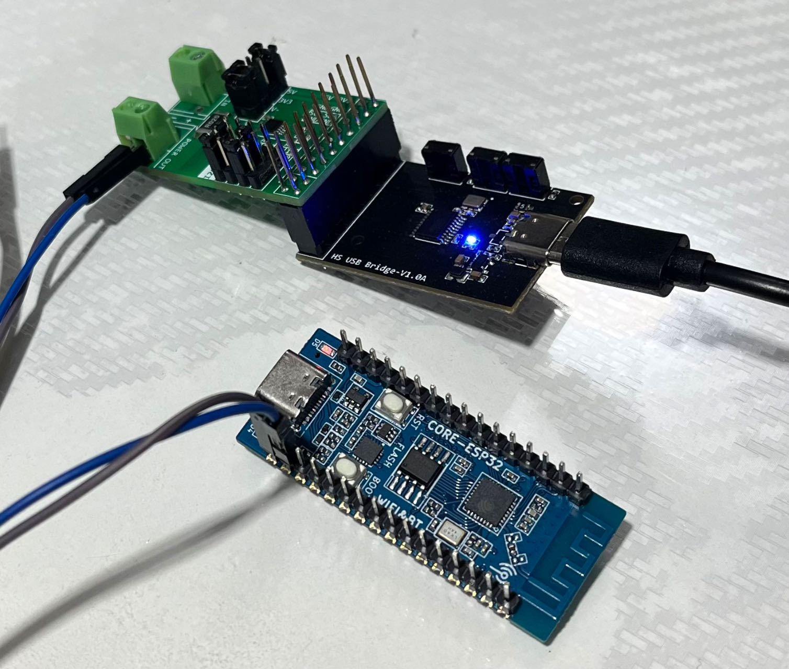
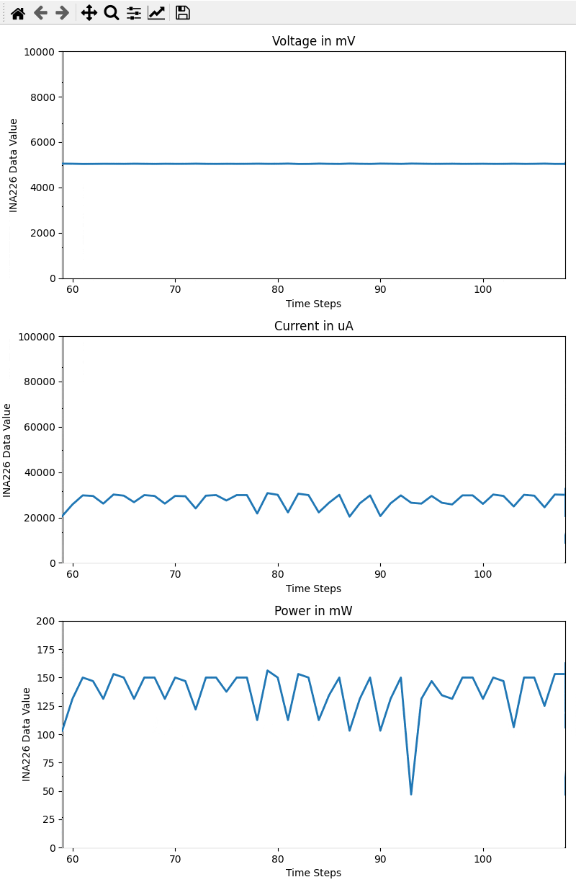

# INA226 I2C/SMBUS 电流计&功率计

[English](README_en.md)

## 简介

采用TI INA226设计的，具有 I2C 兼容接口的高侧/低侧测量、 双向电流/功率监视器模块，引脚兼容 [CH347高速USB桥接模块](https://github.com/pengwon/ch347-hs-usb-bridge)，可以在调试和测试中方便地测量、记录负载电流和功率。

## 特性

- 感测总线电压范围：0V - 36V
- 高侧/低侧电流感测
- 电压、电流、功率测量
- 0.1% 增益误差
- 10uV 偏移
- 可配置测量平均值
- 16个可配置I2C地址
- 2.7V - 5.5V 电源供电
- 2路电源轨，可选为负载电源，作为 [CH347高速USB桥接模块](https://github.com/pengwon/ch347-hs-usb-bridge) 扩展时，为 3.3V 和 5V
- Alert指示灯
- 非共地连接时，可选远端电压感测

## 图片





## 配置



如上图所示，模块主要有2个跳线配置区域，左上的区域可配置DUT供电电源和电压测量，右下的区域可配置模块I2C地址。

### I2C地址



I2C地址由2个跳线配置，分别配置A1和A0，A1和A0都有2位，2个跳线帽分别有4个位置可选，所以一共有$(2^2)^2=16$个可选地址。这个主要用于多个模块同时测量的场景，在硬件接口上也设计为可堆叠，一个CH347模块最多可以接入16个INA226模块。如果没有特别需求，2个跳线帽都接在'00'位置就可以。


### DUT供电电源



DUT供电电源选择，可选'3V3'或'5V'，选择'3V3'时，DUT电源与模块3.3V电源轨连接；选择'5V'时，DUT电源与模块5V电源轨连接。注意这里的'3.3V'和'5V'是针对模块电源轨而言的，具体取决于模块的接口连接，当模块连接CH347模块时，'3.3V'和'5V'分别对应CH347模块的3.3V和5V电源。这个设计主要为方便日常使用，因为大多数电路模块都是3.3V或5V供电。

> **注意**
> 
> 当需要外部电源给DUT供电时，**务必**将这个跳线帽拔下，或接在如下位置，否则将损坏模块。


### 电压测量



电压测量方式可选近端和远端，当用跳线帽连接时，为近端测量；不接跳线帽时，为远端测量。

近端测量时，INA226测量的是模块POWER OUT端子两端的电压；远端测量时，拔下跳线帽，用导线直接将DUT待测点与模块V+、V-连接，INA226测量的是DUT待测点两端的电压。通常情况下采用近端测量就可以，当所测DUT负载电流比较大时（比如1A以上），电源线压降变得可观，此时采用远端测量可以减小线损误差，使测量电压和功率更接近DUT负载。

## 测试



简单测试：

```python
sensor = INA226()
print(sensor.get_config())
sensor.set_alert_limit(0x1000)
print(sensor.get_calibration())
print(sensor.get_shunt_voltage(), 'uV')
print(sensor.get_bus_voltage(), 'mV')
print(sensor.get_current(), 'uA')
print(sensor.get_power(), 'mW')
sensor.set_mask_enable('SOL')
print(sensor.get_mask_enable())
sensor.close()
```

输出：

```powershell
{'reset': False, 'avg': 0, 'vbus_ct': 4, 'vsh_ct': 4, 'mode': 7}
2048
522.5 uV
5040.0 mV
26125.0 uA
134.375 mW
{'SOL': True, 'SUL': False, 'BOL': False, 'BUL': False, 'POL': False, 'CNVR': False, 'AFF': False, 'CVRF': True, 'OVF': False, 'APOL': False, 'LEN': False}
```

动态测试：



## 相关项目

- [WIP] [CH347芯片python库](https://github.com/pengwon/ch347-py)

## 购买

- [淘宝](https://item.taobao.com/item.htm?ft=t&id=739857639619)