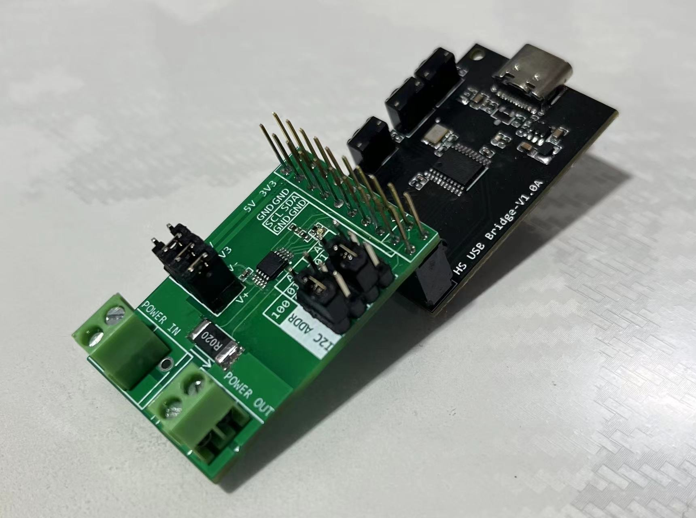

# INA226 I2C/SMBUS 电流计&功率计

[English](README_en.md)

## 简介

采用TI INA226设计的，具有 I2C 兼容接口的高侧/低侧测量、 双向电流/功率监视器模块，引脚兼容 [CH347高速USB桥接模块](https://github.com/pengwon/ch347-hs-usb-bridge)，可以在调试和测试中方便地测量、记录负载电流和功率。

## 特性

- 感测总线电压范围：0V - 36V
- 高侧/低侧电流感测
- 电压、电流、功率测量
- 0.1% 增益误差
- 10uV 偏移
- 可配置测量平均值
- 16个可配置I2C地址
- 2.7V - 5.5V 电源供电
- 2路电源轨，可选为负载电源，作为 [CH347高速USB桥接模块](https://github.com/pengwon/ch347-hs-usb-bridge) 扩展时，为 3.3V 和 5V
- Alert指示灯
- 非共地连接时，可选远端电压感测

## 图片

