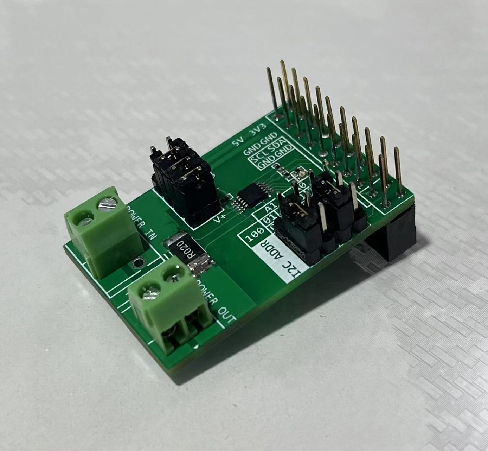
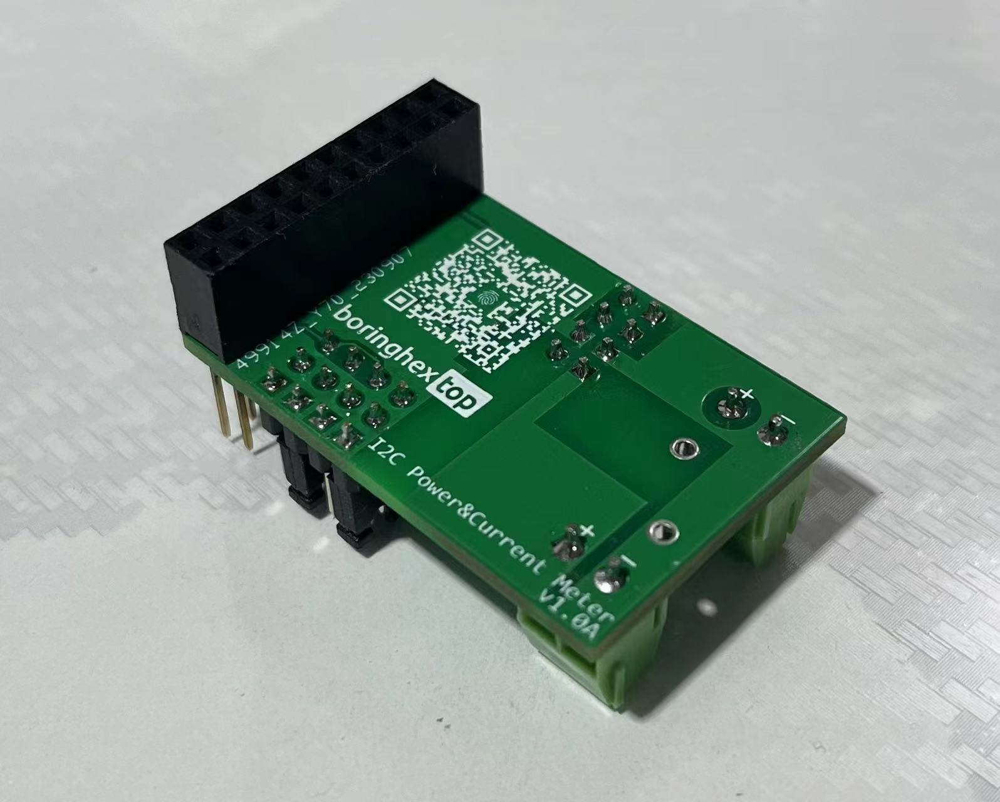
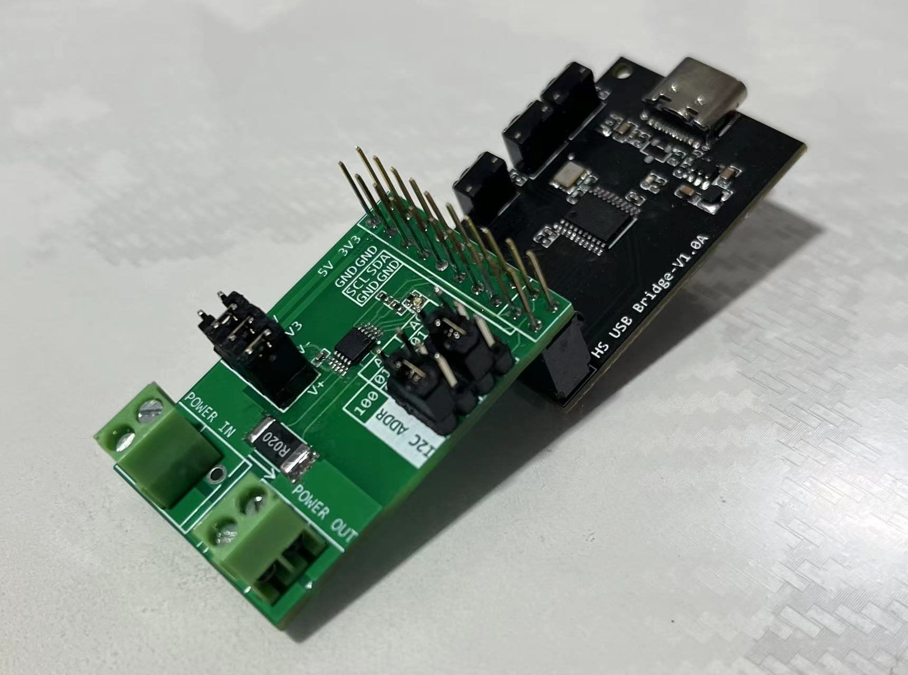
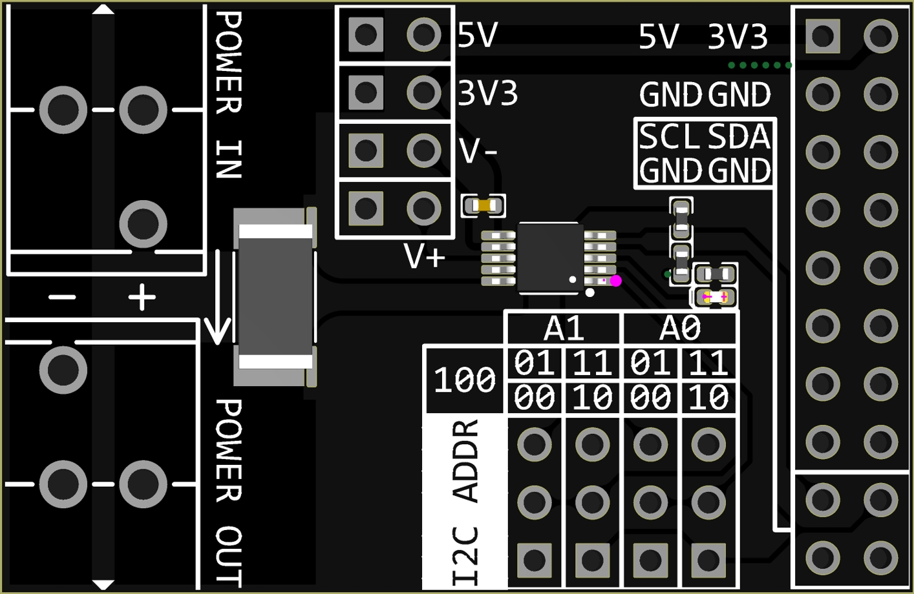
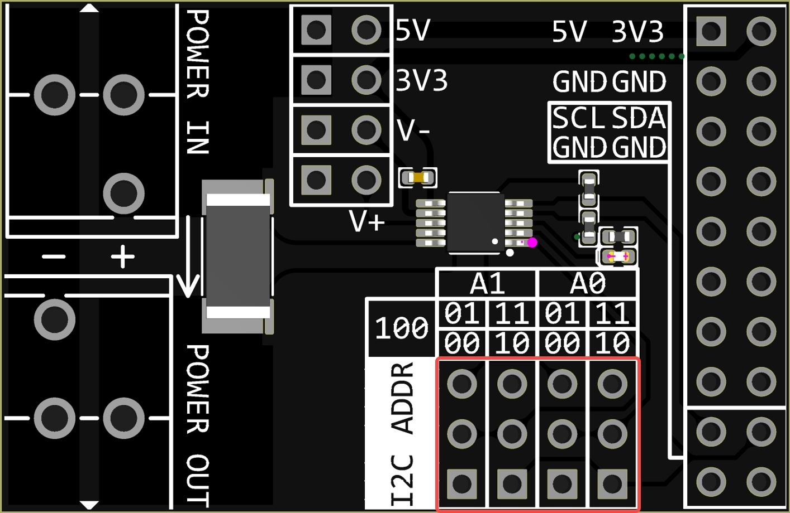
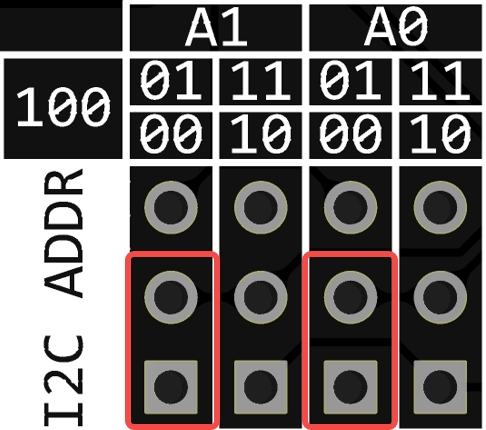
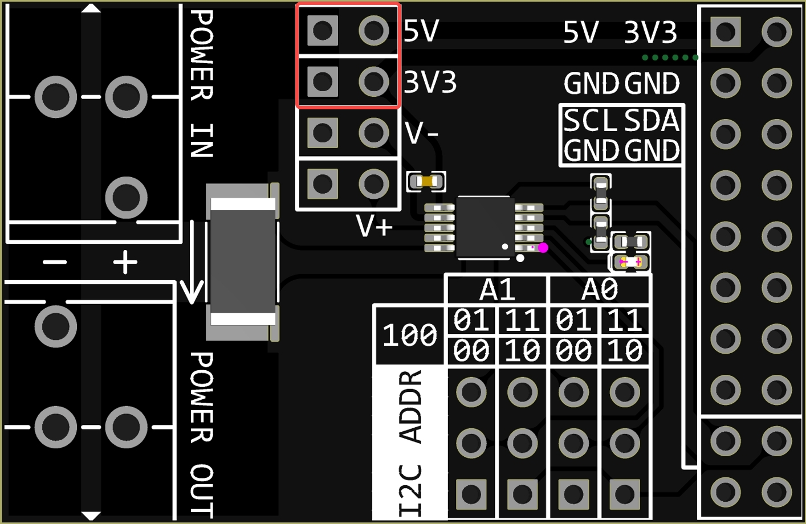
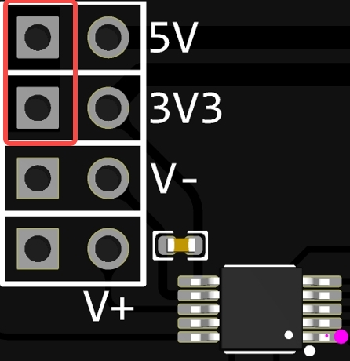
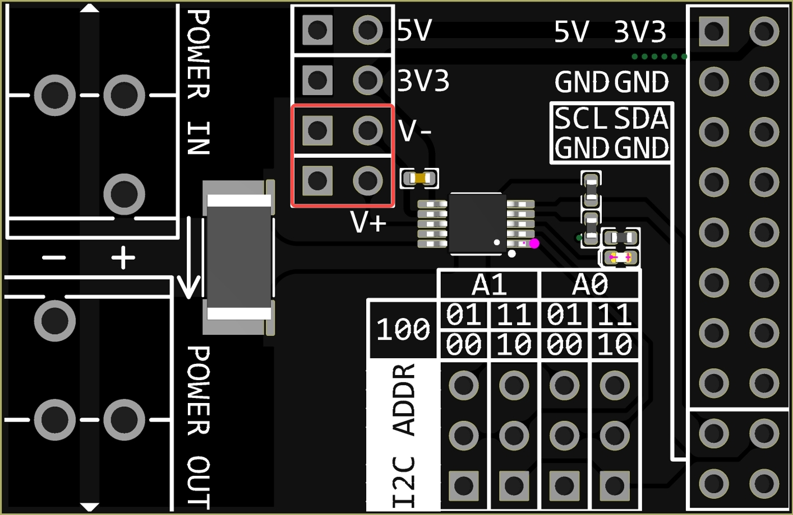
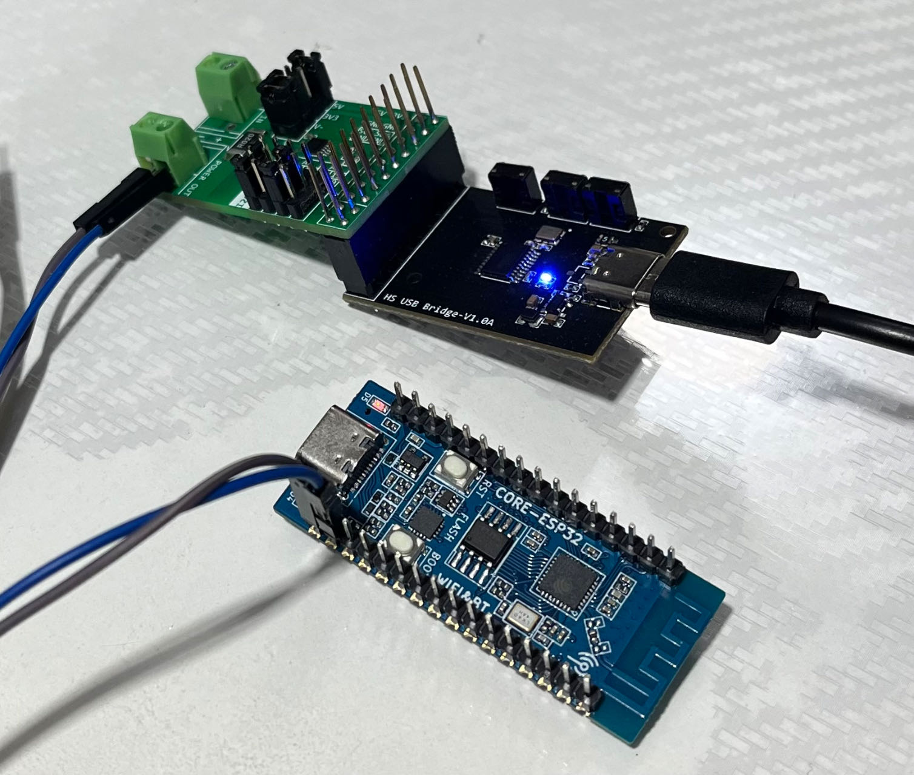

# INA226 I2C/SMBUS Current & Power Monitor

[中文](README.md)

## Introduction

Designed with TI INA226, this module features a high-side/low-side measurement, bidirectional current/power monitor with an I2C-compatible interface. The pins are compatible with the [CH347 High-Speed USB Bridge Module](https://github.com/pengwon/ch347-hs-usb-bridge), making it convenient for measuring and recording load current and power during debugging and testing.

## Features

- Bus voltage sensing range: 0V - 36V
- High-side/low-side current sensing
- Voltage, current, power measurement
- 0.1% gain error
- 10uV offset
- Configurable measurement averaging
- 16 configurable I2C addresses
- 2.7V - 5.5V power supply
- 2 power rails, optional for load power, serving as an extension for [CH347 High-Speed USB Bridge Module](https://github.com/pengwon/ch347-hs-usb-bridge) with 3.3V and 5V
- Alert indicator light
- Optionally remote voltage sensing when not common-ground connected

## Images







## Configuration



As shown in the above image, the module has two jumper configuration areas. The upper-left area configures the DUT power supply and voltage measurement, while the lower-right area configures the I2C address of the module.

### I2C Addresses



The I2C address is configured by two jumpers, A1 and A0, each having 2 bits. There are 4 positions for each jumper cap, resulting in a total of $(2^2)^2=16$ selectable addresses. This is primarily used for scenarios where multiple modules are simultaneously measured. The hardware interface is also designed to be stackable, allowing a CH347 module to connect to a maximum of 16 INA226 modules. If there are no specific requirements, both jumper caps can be connected to the '00' position.



### DUT Power Supply



For DUT power supply selection, you can choose between '3V3' or '5V'. When selecting '3V3', the DUT power is connected to the module's 3.3V power rail. When selecting '5V', the DUT power is connected to the module's 5V power rail. Note that '3.3V' and '5V' refer to the module's power rails and depend on the module's interface connections. When the module is connected to the CH347 module, '3.3V' and '5V' correspond to the CH347 module's 3.3V and 5V power supplies. This design is mainly for everyday convenience, as most circuit modules operate on either 3.3V or 5V.

> **Note**
>
> When an external power supply is required for the DUT, **ensure** to either remove the jumper cap or connect it to the positions shown below; otherwise, the module may be damaged.



### Voltage Measurement



The voltage measurement mode can be selected as either near-end or far-end. When connected with a jumper cap, it is a near-end measurement. Without a jumper cap, it is a far-end measurement.

In near-end measurement, the INA226 measures the voltage across the POWER OUT terminals of the module. In far-end measurement, remove the jumper cap and directly connect the DUT test point to the module's V+ and V- with a wire. The INA226 then measures the voltage across the DUT test point. Generally, near-end measurement is sufficient. However, when the load current of the tested DUT is relatively large (e.g., above 1A), and the voltage drop across the power lines becomes significant, far-end measurement can reduce line loss errors, making voltage and power measurements closer to the DUT load.

## Testing



Simple test:

```python
sensor = INA226()
print(sensor.get_config())
sensor.set_alert_limit(0x1000)
print(sensor.get_calibration())
print(sensor.get_shunt_voltage(), 'uV')
print(sensor.get_bus_voltage(), 'mV')
print(sensor.get_current(), 'uA')
print(sensor.get_power(), 'mW')
sensor.set_mask_enable('SOL')
print(sensor.get_mask_enable())
sensor.close()
```

Output:

```powershell
{'reset': False, 'avg': 0, 'vbus_ct': 4, 'vsh_ct': 4, 'mode': 7}
2048
522.5 uV
5040.0 mV
26125.0 uA
134.375 mW
{'SOL': True, 'SUL': False, 'BOL': False, 'BUL': False, 'POL': False, 'CNVR': False, 'AFF': False, 'CVRF': True, 'OVF': False, 'APOL': False, 'LEN': False}
```

Dynamic test:


## Related Projects

- [WIP] [CH347 Chip Python Library](https://github.com/pengwon/ch347-py)

## Purchase

- [Taobao](https://item.taobao.com/item.htm?ft=t&id=739857639619)